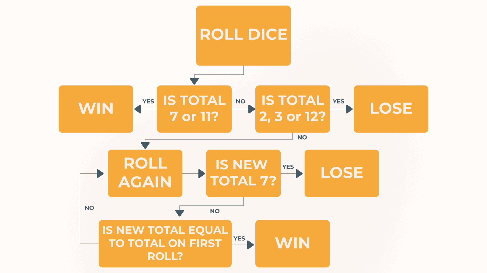

# Crypto Craps

## The Rules

_These are a slightly simplified version of the street craps rules. The main difference is there is only two players, so no pot matching and side bets from additional players._

-   The two players join the game and place their bets.
-   The player roles: `shooter` and `non-shooter` are choosen at random.
-   The `shooter` rolls two, six sided, dice. This is known as the `come out`.
    -   If the total is `7` or `11`, the `shooter` wins.
    -   If the total is `2`, `3`, or `12` the `shooter` loses.
    -   If its `4`, `5`, `6`, `8`, `9`, or `10`, that value is now the `point`.
-   If the `come out` results in a point, the `shooter` rolls until they get the `point` value or a `7`.
    -   If the total is the `point` the `shooter` wins.
    -   If the total is `7` the `shooter` loses.

Here's a flowchart to help:

## Why street craps?

I wanted to build a project that was non-trivial, but wasn't too complicated either. Street craps were the goldilocks conditions for my current skill level. The game has a manageable amount of rules to implement with Solidity and also randomness and automation aspects that I could utilize Chainlink products for.
